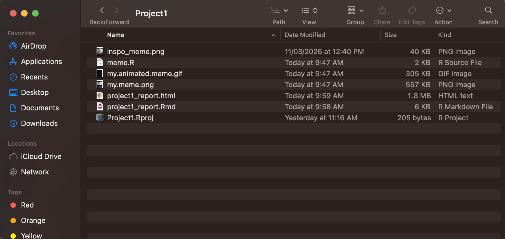
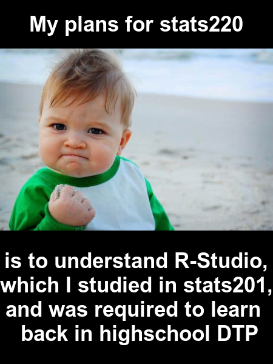

```{r setup, include=FALSE}
knitr::opts_chunk$set(echo=TRUE, message=FALSE, warning=FALSE, error=FALSE)
```

```{css}

.title{
  font-family: "Arial";
  font-size: 2.4;
  color: #3b2f2f;;
}

.subtitle{
  font-family: "Arial";
  font-style: italic;
  color: #6b5744;
}


h2 {
  border-bottom: 2px solid #9b7e5a;
  padding-bottom: 4px;
  color: #3b2f2f;
}

p {
  line-height: 1.75;
  max-width: 800px;
  margin-top: 30px;
}
img {
  border: 3px solid #9b7e5a;
  width: 50%;
  margin-left: auto;
  margin-right: auto;
  display:block;
}

code {
  background-color: #d6ccb4;
  padding: 2px 5px;
  border-radius: 3px;
}
```

## Project requirements
**Project Folder Screenshot:**


**Github Stats220 repo link:** https://github.com/JoseThayil-beep/stats220

## Inspo meme


The "inspo" meme uses the success kid image with his focused and determined expression — contrasting the meme contents about procrastination. The key design components are:

- **Top Text**: The short text sets up the punchline of the meme presented in a black square above the image, centered and bold to attract attention.
- **Base image**: Using the success kid with his serious expression, while being a cute baby creates an comical contrast.
- **Bottom Text**: Long detailed text with multiple number of years mentioned, with similar text styles to attract attention creates a joke about endless procrastination.

## My meme


My new meme uses the same format to joke about procrastination in a more stats220 focused pathway. The key design components are:

- **Top Text**: The short text sets up the punchline of the meme presented in a black square above the image, centered and bold to attract attention, however uses Stats220 to create a niche application of this meme to this class.
- **Base image**: Using the success kid with his serious expression, while being a cute baby creates an comical contrast.
- **Bottom Text**: Long detailed text mentioning multiple years, details my journey through r studio, html and css while highlighting the comical procrastination that I often do alongside these assignments.


## My animated meme 


## Creativity

**For R-Studio:** 

- In the Creativity section, I initially utilized the weight feature for all of the text in my meme inspired from the inspo image that used similar bold text to easily attract attention and bring better visibility to my meme.
- I split the meme image into 3 seperate sections(the top black square with text, image and bottom black square with text), and combined all of these at the same time using the c() function.We learnt how to combine two images but due to my AMAZING creativity I learnt we can combine multiple images and combined 3
- I also used the rep() command in image_animate to optimise code and ensure the meme is readable. 

**For CSS:**

- Use a color scheme that seemed to be aesthetically pleasing to the eyes. (from coolors website https://coolors.co/9b7e5a-d6ccb4-3b2f2f-632a50)
- Added borders and padding underneath the h2 headers to ensure readability and make sure that the website looks fresh and presentable. 
- Added margin on top for text to ensure that the descriptions for inspo meme and my meme are well away from the alternative text of the image.
- Changed Inspo meme size to fit and suit with the other images in the website therefore promoting uniformity and clean website design.
- Messed around with the presentation of code for the website - changing background color and padding to improve contrast and readability
- Added border to img's to fit the colour scheme decided above
- Still don't fully understand display:block; css tag but when removed it removes the center alignment of images(found it on khan academy so its creativity!!)

## Learning reflection

I have previously used HTML and CSS as well as R-studio but the combination of all these tools within the RMD file to create a website, communicating a meme I designed was very informative.
Learning CSS especially helped me understand how the mechanics of the modern day websites and I grew a new found respect for the skill it takes to make a readable and aesthetically pleasing website. I am keen to learn more about designing a good looking website to ensure that the information is presentable and readable to its audiences. Using R-studio to code an animated image using magick was also quite cool and I’d be keen to learn more coding.

## Appendix

<mark>Do not change, edit, or remove the `R` chunk included below.</mark> 

If you are working within RStudio and within your Project1 RStudio project (check the top right-hand corner says "Project1"), then the code from the `meme.R` script will be displayed below.

This code needs to be visible for your project to be marked appropriately, as some of the criteria are based on this code being submitted.


```{r file='meme.R', eval=FALSE, echo=TRUE}

```

