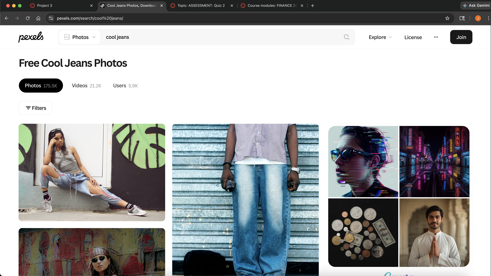

```{r setup, include=FALSE}
knitr::opts_chunk$set(echo=TRUE, message=FALSE, warning=FALSE, error=FALSE)
library(tidyverse)
selected_photos <- read_csv("selected_photos.csv")
```


```{css, echo=FALSE}
.title{
  font-family: "Arial";
  font-size: 2.4px;
  color: #3b2f2f;;
}

.subtitle{
  font-family: "Arial";
  font-style: italic;
  color: #6b5744;
}

h1 {
  border-bottom: 2px solid #9b7e5a;
  padding-bottom: 4px;
  color: #3b2f2f;
  margin-left: auto;
  display:block;
}

ol {
  line-height: 1.75;
  max-width: 800px;
  margin-top: 30px;
  margin-left: auto;
  margin-right: auto;
  display:block;
}
p {
  line-height: 1.75;
  max-width: 800px;
  margin-top: 30px;
  margin-left: auto;
  margin-right: auto;
  display:block;
}
img {
  border: 3px solid #9b7e5a;
  width: 50%;
  margin-left: auto;
  margin-right: auto;
  display:block;
}
```


## Introduction

The two words that I picked for this project was "cool jeans", primarily because I was shopping for jeans and decided that if I was generating an API from pexels(working for my statistics project) I might as well look for inspiration pics for jeans.

The URL is [API Link](https://api.pexels.com/v1/search?query=cool+jeans&per_page=80).


The three things I noticed from these images are:

1. The image contains a mixture of both landscape and portrait images.
2. Almost always contained a human model wearing jeans with a focus on the lower body as the jeans take up a majority of the image.
3. Primary colour of blue existed both in the background and in the colour of the jeans worn by the models in pictures.

### Table of URL's

```{r}
selected_photos %>%
  select(url) %>%
  knitr::kable()
```

## Key features of my selected photos
<!-- Calculating Summary Values -->
```{r}
  # Summary median width values for data frame selected_photos
median_width <- selected_photos$width %>%
  median(na.rm = T)
# Summary median height values for data frame selected_photos
median_height <- selected_photos$height %>%
  median(na.rm = T)
# Number of landscape photos in the data frame selected_photos
count_landscape <- sum(selected_photos$orientation == "landscape", na.rm = T)
# Number of portrait photos in the data frame selected_photos
count_portrait <- sum(selected_photos$orientation == "portrait", na.rm = T)
  

# Grouped Summary Values for number of data points organised by Categorical variable: orientation
grouped_count <- selected_photos %>%
  group_by(orientation) %>%
  summarise(num_pictures = n())

# Grouped Summary Values for total median width organised by Categorical variable: orientation
grouped_width <- selected_photos %>%
  group_by(orientation) %>%
  summarise(median_width = median(width, na.rm = T))

# In-line R-code variables for median width landscape
median_width_landscape <- grouped_width %>%
  filter(orientation == "landscape") %>%
  pull(median_width)

# In-line R-code variables for median width portrait
median_width_portrait <- grouped_width %>%
  filter(orientation == "portrait") %>%
  pull(median_width)
```

The median height of all images in selected_photos is `r median_height`.
The median width of all images in selected_photos is `r median_width`.

**The variable orientation has 2 data values - portrait and landscape(effetively splitting my data in two :p).** 
The data frame - selected photos, has `r count_landscape` landscape images while it has `r count_portrait` portrait images.

Selected_photos data frame has a median width of `r median_width_landscape` for its landscape images.
Selected_photos data frame has a median width of `r median_width_portrait` for its portrait images.

This makes sense because landscape images primary trait is that they are wider than they are long.

## Creativity
```{r}
library(magick)
img1 <- image_read(selected_photos$large[1]) %>% image_scale("600x400!")
img2 <- image_read(selected_photos$large[3]) %>% image_scale("600x400!")
img3 <- image_read(selected_photos$large[5]) %>% image_scale("600x400!")

# Odd Image Out
img_oddone <- image_read(selected_photos$large[8]) %>% image_scale("600x400!")

# Annotating each frame with the meme text
img1 <- image_annotate(img1,
                       text = "everyone wearing jeans...",
                       gravity = "north",
                       size = 40,
                       color = "black")
img2 <- image_annotate(img2,
                       text = "jeans. jeans. jeans.",
                       gravity = "north",
                       size = 40,
                       color = "white")
img3 <- image_annotate(img3,
                       "always jeans.",
                       gravity = "north",
                       size = 40,
                       color = "white")
img_oddone <- image_annotate(img_oddone,
                             "Me: I'm nothing like the rest of yall",
                             gravity = "north",
                             size = 40,
                             color = "yellow")

# Combining images so that I can animate them into a gif
meme_gif <- c(img1, img2, img3, img_oddone) %>%
  image_animate(fps = 0.5)
```


OK

I KNOW IT MIGHT BE CRINGE BUT I WORKED HARD FOR THIS.

I applied Creativity for Project 3 as I combined my genuine passion for clothing and fashion with my research for this project.
I used module 1 magick package tools such as image_annotate, image_read and image_scale to create my meme and used image_animate to create a gif that can better encapsulate humour.
Used features from module 2, like using the dollar sign($) to pull specific images from a data frame and the square brackets[] to pick an individual picture.

The text in the gif creates a story throughout the meme(of how everyone wore jeans as bottoms) and the usage of different text colours improved readability and added a humorous element to my image.

Spent some time in searching for image 8(the odd one out) to construct this meme. I did get some surprisingly neat inspo's from this research as well :).


## Learning Reflection

The usage of R-studios to group variables(orientation) in a data frame by other variables(height) and perform calculations so as to provide a holistic analysis of the data was an especially neat idea I learnt from this module. I enjoyed the incorporation of JSON in our course materials so as to get used to multiple methods of data manipulation as converting it to tables in a more human readable manner. And finally the usage of the magick package to create images again(got stuck on combining the images together before animating, so a revision is in order). But the aspect of tying every module we worked on together towards a single goal was illuminating. Very cool. Very Fun. 10 / 10.

## Appendix

```{r file='exploration.R', eval=FALSE, echo=TRUE}

```
```{r file='project3_report.Rmd', eval=FALSE, echo=TRUE}

```
