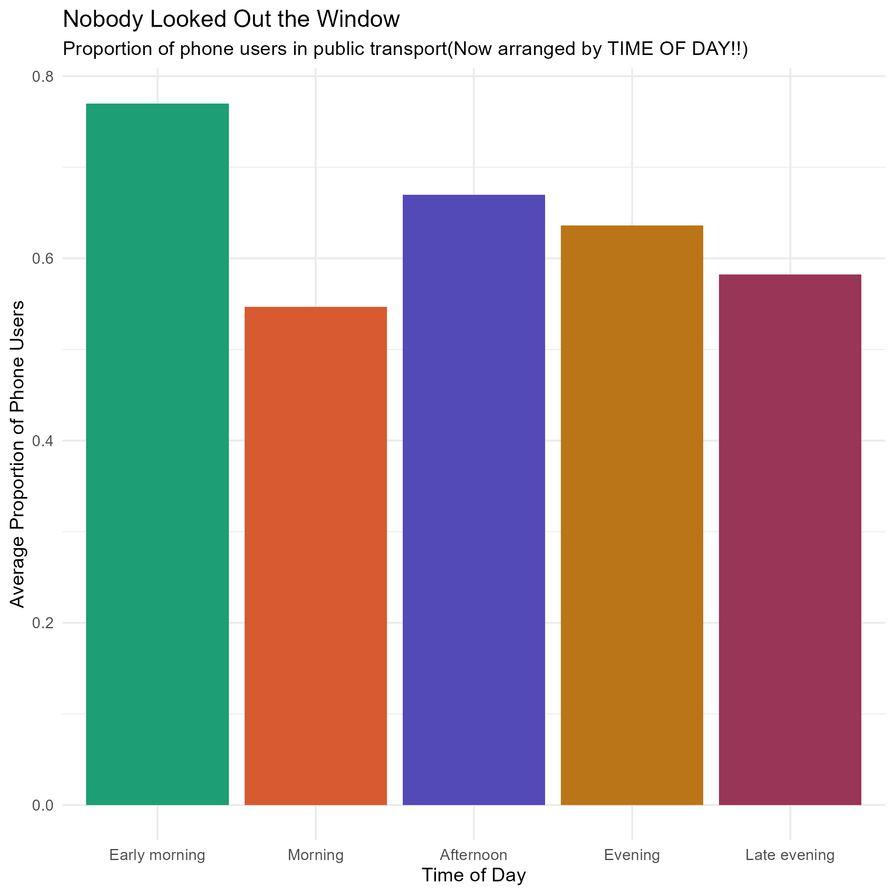
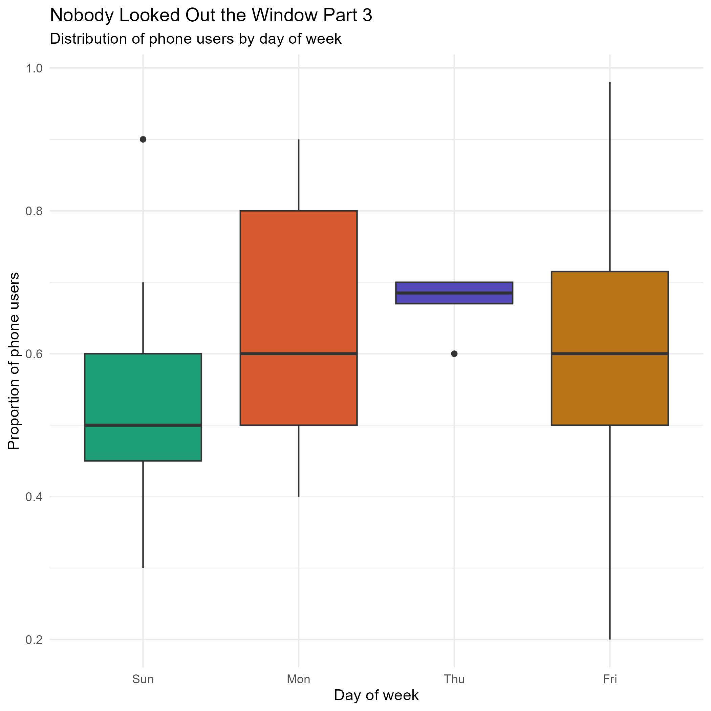

<script src="https://code.jquery.com/jquery-3.7.1.min.js" integrity="sha256-/JqT3SQfawRcv/BIHPThkBvs0OEvtFFmqPF/lYI/Cxo=" crossorigin="anonymous"></script>

```{r setup, include=FALSE}
knitr::opts_chunk$set(echo=FALSE, message=FALSE, warning=FALSE, error=FALSE)
```

```{js}
$(function() {
  $(".level2").css('visibility', 'hidden');
  $(".level2").first().css('visibility', 'visible');
  $(".container-fluid").height($(".container-fluid").height() + 300);
  $(window).on('scroll', function() {
    $('h2').each(function() {
      var h2Top = $(this).offset().top - $(window).scrollTop();
      var windowHeight = $(window).height();
      if (h2Top >= 0 && h2Top <= windowHeight / 2) {
        $(this).parent('div').css('visibility', 'visible');
      } else if (h2Top > windowHeight / 2) {
        $(this).parent('div').css('visibility', 'hidden');
      }
    });
  });
})
```

```{css, echo=FALSE}

body {
  font-family: 'Georgia', serif;
  background-color: #f9f6f1;
  color: #2c2c2c;
}

h1, h2, h3 {
  font-family: 'Arial', sans-serif;
}

h2 {
  color: #51087E;
  border-left: 5px solid #534AB7;
  padding-left: 12px;
  border-top: 15px;
}

p {
  font-size: 1.1em;
  line-height: 1.75;
  max-width: 780px;
}

img {
  border-radius: 8px;
  max-width: 100%;
}

```

## The Question: Are We All Just Staring at Our Phones on the Bus?

This data story explores phone use on public transport, based on observations collected by a group of students riding buses at various times of day and days of the week.

Each observation recorded the **proportion of visible passengers using a mobile device** — including the observer themselves. Across different time slots and days, we asked: *just how glued to their screens are people on public transport?*

The short answer? Pretty damn glued. The overall mean proportion of phone users was around **0.62** — meaning roughly 6 in 10 people on any given bus ride were on their phones.

## Part 1: When Are People Most Phone-Obsessed?



Early morning commuters (5–9 am) were by far the heaviest phone users, with an average proportion of **~0.77**. This makes intuitive sense(I myself stayed on my phone throughout early mornings) — bleary-eyed passengers in the pre-dawn hours are probably using their phones to stay awake, check the news, or scroll social media before the day begins.

Interestingly, the **morning period (9 am–12 pm)** saw the *lowest* phone use at ~0.55. Perhaps people are more alert or more likely to be reading, chatting, or simply watching the world go by once the sun is properly up. It could also very much be the lack of data *5/42* ~ or around a tenth of our data.

Afternoon and evening usage remained elevated, suggesting phones are a consistent companion across most of the day.


## Part 2: How Spread Out Is the Phone Use?


The density plot reveals not just averages, but the *shape* of the data. A few key observations:

- **Early morning** (green) has a broad, high-peaked distribution skewed toward higher proportions — some observations recorded near-complete phone saturation (close to 1.0).
- **Morning** (orange-red) has a sharp, narrow peak around 0.5, suggesting more consistent (and moderate) phone use.
- **Afternoon** (purple) shows a bimodal(ooooh fancy stats word) pattern — some rides were low-phone, others high, with less consistency.

The **purple vertical line** marks the overall mean (~0.62), showing that most time periods cluster reasonably close to this figure, but with real variation in the spread.

## Part 3: Does the Day of the Week Matter?



Data was collected on four days: **Sunday, Monday, Thursday, and Friday**. 

- **Monday** had the widest spread of phone-use proportions, with an interquartile range from roughly 0.5 to 0.8. Start-of-week bus rides appear to be highly variable — some buses were packed with phone users, others less so.
- **Thursday** showed a very tight distribution near 0.69, suggesting highly consistent phone use on that day — though this may reflect fewer observations.
- **Sunday and Friday** had median phone use around 0.5–0.6 with moderate spread.

While the day of the week shows some variation, the data suggests that **time of day** (Part 1 & 2) is likely a stronger predictor of phone use than the specific day.

## The Takeaway: Nobody Looked Out the Window

Across all times and days observed, phone use on public transport was consistently high — rarely dropping below 50% and frequently reaching 70–80% during early morning rides. 

Whether it's the Monday morning dread, the afternoon slump, or the late-night scroll, passengers on public transport are overwhelmingly reaching for their devices. The window? Largely ignored.

*Data collected via self-reported observation logs by STATS 220 students at the University of Auckland.*
