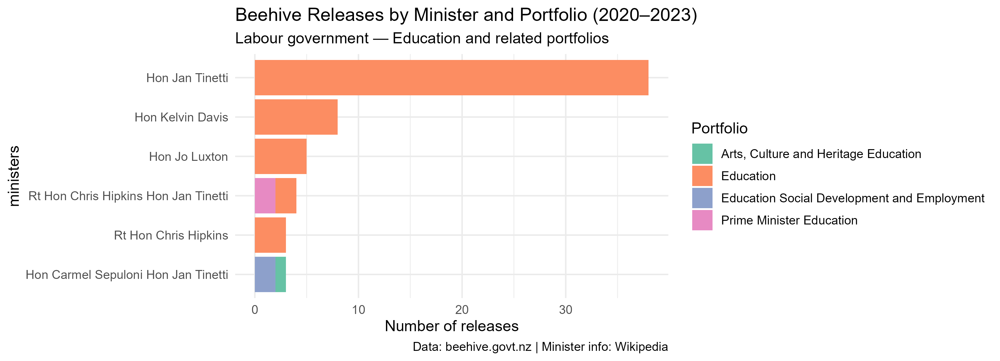

``` {css, echo=FALSE}

body {
  font-family: 'Georgia', serif;
  background-color: #f9f6f1;
  color: #2c2c2c;
}

h1, h2, h3 {
  font-family: 'Arial', sans-serif;
}

h2 {
  color: #51087E;
  border-left: 5px solid #534AB7;
  padding-left: 12px;
  border-top: 15px;
}

p {
  font-size: 1.1em;
  line-height: 1.75;
  max-width: 780px;
}

img {
  display: block;
  margin-left: auto;
  margin-right: auto;
}

```


## Introduction

I took a sweet second on the beehive website primarily cause I spent to long deciphering how to navigate the advanced settings and search terms. With the help of my group members - Adrien Lydford, I finally managed to sort it out and picked Education portfolios for labours term(2020-2023). Or in fancy language

"All press releases  from the Education portfolio during the Labour (53rd Parliament) government on beehive.govt.nz"

For scraping the beehive the robots.txt disallows crawling of admin, user, and core system paths. All the public content pages I have used for this project are not disallowed, so scraping is permitted

Furthermore, beehives' copyright permits reproduction as long as I reproduce content material accurately - I most definitely have tried to do so with my visualisation.

## Visualisation

The purpose of this visualisation is to show the breakdown of Beehive press 
releases by minister and portfolio for the Labour government's 2020–2023 term, 
revealing which ministers were active across multiple portfolios and which 
focused on a single area.



## Creativity

My primary creativity for this project involved tying in my personal passions/job - I work as a tutor and was really interested in the recent news of the NCEA system being phased out in National's government by the end of this year. So I initially sought out education portfolios under National but as it came under 60 results had to resort to the previous term with cindy's labour(2020-2023).

Also employed creativity with the CSS for this very page(A soothing sight I hope after multiple base project5_reports).

And finally I'm rather proud of my methodology to create a vector for the ministers names, replacing the honorfics "Hon| Rt Hon" with "hi" and then seperating the rows everytime it detected "hi".

(I added a alt text for my visualisation!!)

## Learning reflection

Honestly the part that I actually liked the most was the ethics of data collection and scraping - the robots.txt file that shows the copyright. Scraping generally has a negative persona, but ethical scraping to collect data looks pretty clean.

Using API's especially the wikipedia API to receive data in long form(I thought I did something wrong spent too long on this), was also a cool feature I learnt in Project 5.


## Self review

My Chosen Learning Objective: 
Demonstrate understanding of programming concepts and skills associated with importing, wrangling and visualising data for decision making, using R (Capability 3, 4 and 5)

Was perhaps my most liked and influential topic of STATS 220. Understanding programming concepts and skills required for manipulating data to visualize it for decision making was cool. As a complete beginner to R-studio, I feel 220 does teach the bases of R really well, but I do need to get practice in to become competent like some of my lecturers. But yeah, Stats 220 was definitely a great intro to R and I am glad to have completed all 5 projects, maybe something that I can look back on in the future.


## Appendix

```{r file='scrape_html.R', eval=FALSE, echo=TRUE}
```

```{r file='data_sources.R', eval=FALSE, echo=TRUE}
```

```{r file='visualisation.R', eval=FALSE, echo=TRUE}
```